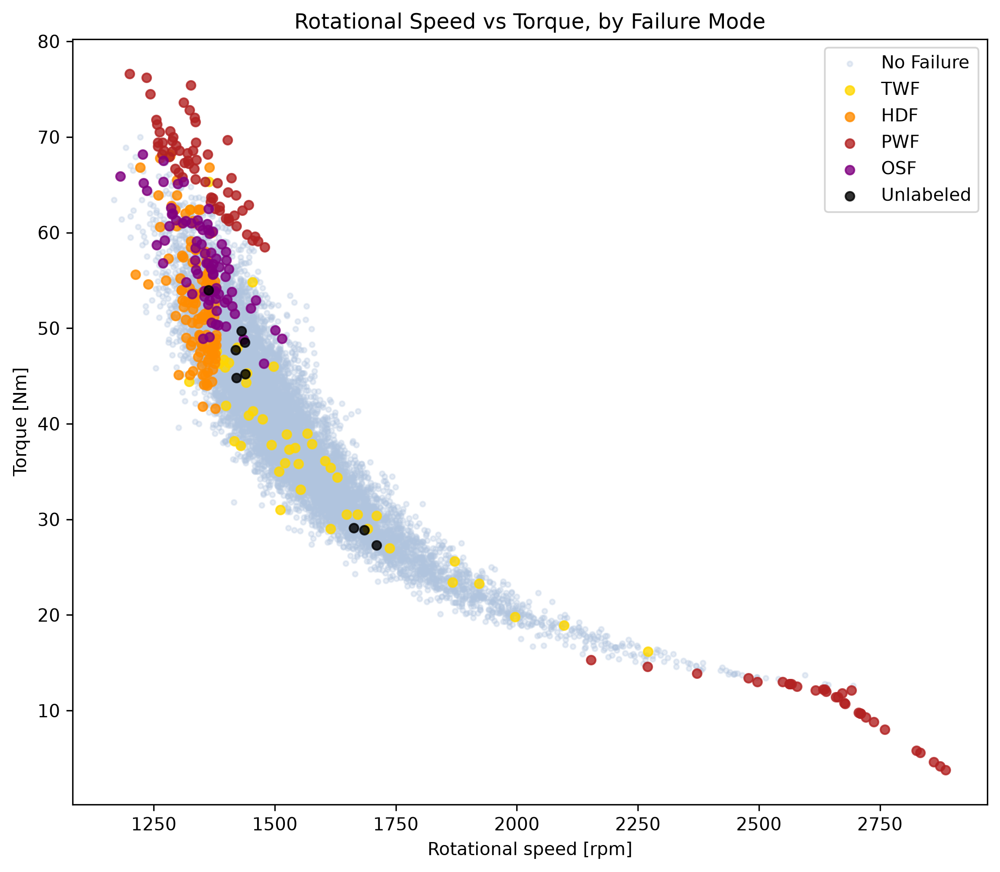
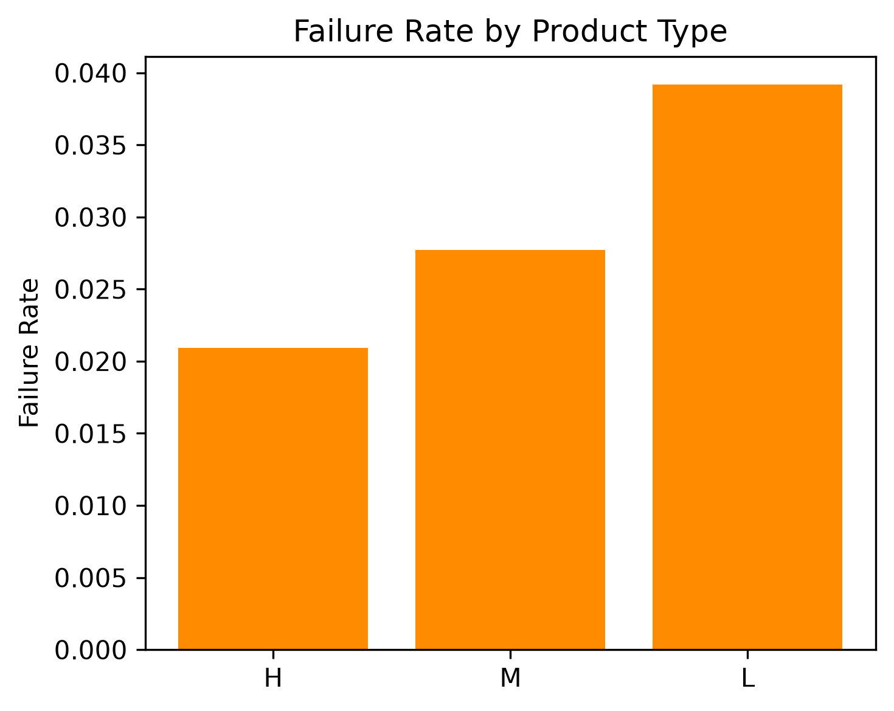
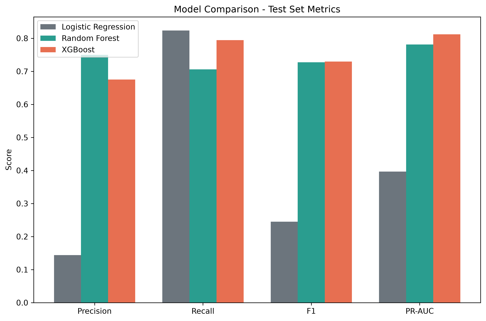
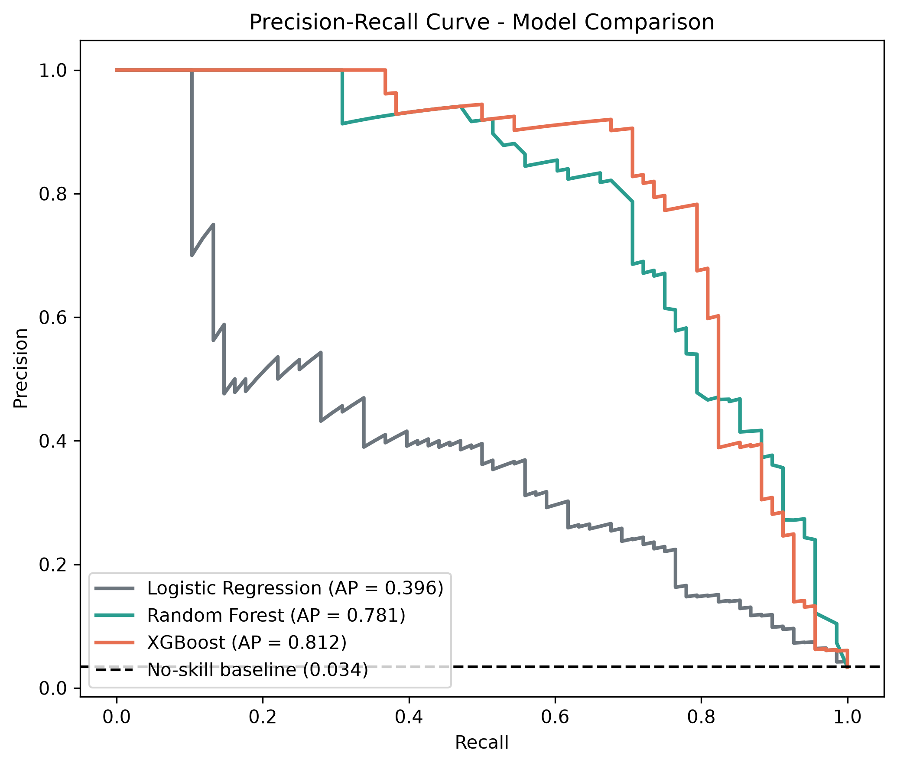
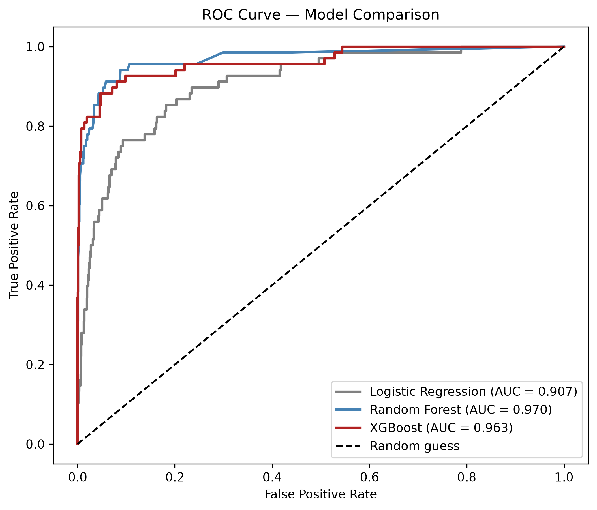

# ⚙️ Predictive Maintenance: Machine Failure Classification


---

## My Motivation

Modern manufacturing depends heavily on reliable industrial machinery. Unexpected machine failures can lead to production downtime, costly repairs, and inefficient maintenance. Instead of waiting for equipment to fail or relying entirely on fixed maintenance schedules, **predictive maintenance** uses machine data to identify patterns that may indicate an upcoming failure.

There are several ways machine learning can contribute to manufacturing, from analyzing production patterns to monitoring equipment through sensor data. In particular, sensor measurements can reveal relationships and operating conditions associated with machine failures.

In this project, I explore **predictive maintenance** using the AI4I 2020 dataset. I compare three classification approaches - Logistic Regression, Random Forest, and XGBoost - to predict whether a machine will fail based on sensor readings and product type.

The main objective is not only to find the best-performing model, but also to examine the trade-off between **missing actual failures** and **generating unnecessary alerts**, and determine which model is more suitable depending on the priorities of the application.

---

## 🔎 Project Overview

Manufacturing equipment failures are costly and often preventable.

This project uses machine sensor data to predict whether a machine will experience a failure. The available measurements include:

* Air temperature
* Process temperature
* Rotational speed
* Torque
* Tool wear
* Product type

The project follows a simple machine learning workflow:

1. Data inspection and sanity checking
2. Exploratory data analysis
3. Data preprocessing
4. Train/test splitting and cross-validation
5. Logistic Regression baseline
6. Random Forest
7. XGBoost
8. Model evaluation and comparison
9. Error and performance analysis

Because machine failures represent only **~3.4% of the observations**, particular attention is given to the severe class imbalance and to metrics that are more informative than accuracy.

---

## 🏭 Dataset

The project uses the **AI4I 2020 Predictive Maintenance Dataset** from the [UCI Machine Learning Repository](https://archive.ics.uci.edu/dataset/601/ai4i+2020+predictive+maintenance+dataset).

The dataset contains:

* **10,000 observations**
* **14 columns**
* Sensor measurements
* Product type
* Machine failure labels

### Features

| Feature                   | Description                     |
| ------------------------- | ------------------------------- |
| `Type`                    | Product quality/type            |
| `Air temperature [K]`     | Air temperature                 |
| `Process temperature [K]` | Process temperature             |
| `Rotational speed [rpm]`  | Machine rotational speed        |
| `Torque [Nm]`             | Torque generated by the machine |
| `Tool wear [min]`         | Tool usage time                 |
| `Machine failure`         | Overall binary failure target   |

The dataset also contains five individual failure-mode indicators:

* `TWF` - Tool Wear Failure
* `HDF` - Heat Dissipation Failure
* `PWF` - Power Failure
* `OSF` - Overstrain Failure
* `RNF` - Random Failure

These individual failure-mode labels were treated as target-leaking information and were therefore excluded from the predictive features.

---

## 🔬 Exploratory Data Analysis

The initial analysis examined:

* Dataset dimensions
* Data types
* Missing values
* Duplicate observations
* Numerical feature distributions
* Feature correlations
* Failure rates
* Failure patterns across operating conditions
* Failure rates across product types

The dataset contains a severe class imbalance, with machine failures representing only approximately **3.4%** of all observations.

### Failure Patterns

Machines do not fail randomly across all operating conditions. The analysis revealed two distinct operating zones where failures tend to cluster:

* **Low-speed / high-torque**
* **High-speed / low-torque**

These regions are associated with different failure mechanisms.



### Failure Rate by Product Type

An interesting finding was that the **lowest-quality product variant (Type L)** had the highest observed failure rate rather than the highest-quality variant.



The complete exploratory analysis is available in [`01_inspection_and_EDA.ipynb`](./notebooks/01_inspection_and_EDA.ipynb).

---

## ⚙️ Data Preprocessing

Before training the models, the dataset was prepared through the following steps:

* Checked for missing values and duplicate observations
* Verified feature types and data integrity
* Removed identifier columns
* Removed the individual failure-mode flags to prevent target leakage
* One-hot encoded the categorical `Type` feature
* Performed a stratified train/test split
* Used **10-fold stratified cross-validation** during model evaluation

Stratification was used to preserve the minority failure class across the training and test sets.

---

## 🤖 Modeling Strategy

Three classification approaches were evaluated.

### 1. Logistic Regression

Logistic Regression was used as an interpretable baseline.

It provides a simple reference point for evaluating whether more complex ensemble models provide a meaningful improvement.

### 2. Random Forest

Random Forest was selected as a bagging-based ensemble method.

It can capture nonlinear relationships and interactions between the sensor measurements while remaining relatively robust to noisy features.

### 3. XGBoost

XGBoost was selected as a boosting-based ensemble method.

It builds an ensemble of decision trees sequentially, allowing later trees to focus on errors made by previous trees.

The goal was to compare these models under the same classification task and determine how their performance differs when predicting the minority failure class.

---

## 📏 Evaluation Metrics

Because the dataset is highly imbalanced, **accuracy alone would be misleading**.

The following metrics were used:

### Precision

**Precision** measures the proportion of predicted failures that are actually failures.

A higher precision means fewer false alarms.

### Recall

**Recall** measures the proportion of actual machine failures that the model successfully detects.

A higher recall means fewer missed failures.

### F1-Score

**F1-score** combines precision and recall into a single metric and is useful when both false alarms and missed failures matter.

### ROC-AUC

**ROC-AUC** measures how well the model separates failure and non-failure observations across different classification thresholds.

### PR-AUC

**PR-AUC** summarizes the precision-recall trade-off across classification thresholds.

Because the failure class is highly imbalanced, **PR-AUC was given particular importance** when comparing the models.

---

## 📈 Results

The final models were evaluated using precision, recall, F1-score, ROC-AUC, and PR-AUC.

| Model               | Precision |    Recall |        F1 |   ROC-AUC |    PR-AUC |
| ------------------- | --------: | --------: | --------: | --------: | --------: |
| Logistic Regression |     0.144 | **0.824** |     0.245 |     0.907 |     0.396 |
| Random Forest       | **0.750** |     0.706 |     0.727 | **0.970** |     0.781 |
| **XGBoost**         |     0.675 |     0.794 | **0.730** |     0.963 | **0.812** |

### Model Comparison



### Precision-Recall Curves



### ROC Curves



---

## 🏆 Model Analysis

The results reveal an important trade-off between **detecting failures** and **avoiding false alarms**.

### Logistic Regression

Logistic Regression achieved the **highest recall (0.824)**, meaning it detected the largest proportion of actual machine failures.

However, its precision was only **0.144**.

This means that approximately **86% of its failure alerts were false alarms** at the evaluated operating point.

Therefore, despite its high recall, Logistic Regression provides a poor precision-recall balance for this dataset.

### Random Forest

Random Forest achieved the **highest precision (0.750)** and the highest ROC-AUC (0.970).

This makes it a strong option when minimizing false alarms is particularly important.

Its recall of **0.706**, however, means that it misses more actual failures than XGBoost and Logistic Regression.

### XGBoost

XGBoost achieved the **highest PR-AUC (0.812)** and the highest F1-score (0.730).

It also achieved a recall of **0.794**, while maintaining substantially better precision than Logistic Regression.

This gives XGBoost the best overall balance between detecting failures and limiting false alarms among the three evaluated models.

---

## ✅ Recommendation

**XGBoost is the recommended model when both failure detection and false-alarm reduction are important.**

It achieved the best **PR-AUC (0.812)** and **F1-score (0.730)**, indicating the strongest overall precision-recall trade-off among the evaluated models.

**Random Forest** is a strong alternative when minimizing false alarms is the higher priority, as it achieved the highest precision at **0.750**.

**Logistic Regression** achieved the highest recall at **0.824**, making it useful when detecting as many failures as possible is the primary concern. However, its very low precision means that this comes at the cost of a large number of false alarms.

In a real predictive-maintenance system, the final model should therefore depend on the relative operational cost of **missed failures versus unnecessary maintenance alerts**.

---

## 🗂️ Project Structure

```text
📁
├── 📁 assets
│   └── 📁 plots
│       ├── 🖼️ boxplot_Air_temperature_by_failure.png
│       ├── 🖼️ boxplot_Process_temperature_by_failure.png
│       ├── 🖼️ boxplot_Rotational_speed_by_failure.png
│       ├── 🖼️ boxplot_Tool_wear_by_failure.png
│       ├── 🖼️ boxplot_Torque_by_failure.png
│       ├── 🖼️ boxplots_by_failure_combined.png
│       ├── 🖼️ correlation_matrix.png
│       ├── 🖼️ distribution_Air_temperature.png
│       ├── 🖼️ distribution_Process_temperature.png
│       ├── 🖼️ distribution_Rotational_speed.png
│       ├── 🖼️ distribution_Tool_wear.png
│       ├── 🖼️ distribution_Torque.png
│       ├── 🖼️ failure_rate_by_type.png
│       ├── 🖼️ numeric_distributions_combined.png
│       ├── 🖼️ scatter_speed_vs_torque_by_failure.png
│       ├── 🖼️ scatter_speed_vs_torque_by_failure_mode.png
│       └── 🖼️ Target_Distribution.png
├── 📁 config
│   ├── 🐍 constants.py
│   └── 🐍 paths.py
├── 📁 Dataset
│   ├── 📁 processed
│   │   ├── 📊 x_test.csv
│   │   ├── 📊 x_train.csv
│   │   ├── 📊 y_test.csv
│   │   └── 📊 y_train.csv
│   └── 📊 ai4i2020.csv
├── 📁 notebooks
│   ├── 📄 01_inspection_and_EDA.ipynb
│   ├── 📄 02_preprocessing.ipynb
│   ├── 📄 03_logistic_regression.ipynb
│   ├── 📄 04_random_forest.ipynb
│   ├── 📄 05_xgboost.ipynb
│   └── 📄 06_comparison.ipynb
├── 📁 results
│   ├── 📁 logistic_regression
│   │   ├── 📁 charts
│   │   │   ├── 🖼️ coefficients.png
│   │   │   ├── 🖼️ confusion_matrix.png
│   │   │   ├── 🖼️ pr_curve.png
│   │   │   └── 🖼️ roc_curve.png
│   │   ├── 📊 metrics.csv
│   │   └── 📄 model.pkl
│   ├── 📁 random_forest
│   │   ├── 📁 charts
│   │   │   ├── 🖼️ confusion_matrix.png
│   │   │   ├── 🖼️ feature_importance.png
│   │   │   ├── 🖼️ pr_curve.png
│   │   │   └── 🖼️ roc_curve.png
│   │   ├── 📊 metrics.csv
│   │   └── 📄 model.pkl
│   ├── 📁 xgboost
│   │   ├── 📁 charts
│   │   │   ├── 🖼️ confusion_matrix.png
│   │   │   ├── 🖼️ feature_importance.png
│   │   │   ├── 🖼️ pr_curve.png
│   │   │   └── 🖼️ roc_curve.png
│   │   ├── 📊 metrics.csv
│   │   └── 📄 model.pkl
│   ├── 🖼️ model_comparison_bars.png
│   ├── 🖼️ model_comparison_pr_curves.png
│   └── 🖼️ model_comparison_roc_curves.png
├── ⚖️ LICENSE
├── 📘 README.md
└── 📝 requirements.txt
```

> Generated using [directory-tree-printer](https://github.com/AmirmasoudCS/Tree-Printer.git)

---

## 🚀 Installation

Clone the repository:

```bash
git clone <repo-url>
cd Predictive-Maintenance
```

Create a virtual environment:

```bash
python -m venv .venv
```

Activate the virtual environment:

**Windows:**

```bash
.venv\Scripts\activate
```

**Linux/macOS:**

```bash
source .venv/bin/activate
```

Install the requirements:

```bash
pip install -r requirements.txt
```

---

## ▶️ Running the Project

The analysis workflow is organized into six notebooks that should be run in order:

1. [`01_inspection_and_EDA.ipynb`](./notebooks/01_inspection_and_EDA.ipynb) - dataset inspection and exploratory data analysis
2. [`02_preprocessing.ipynb`](./notebooks/02_preprocessing.ipynb) - data preparation and train/test splitting
3. [`03_logistic_regression.ipynb`](./notebooks/03_logistic_regression.ipynb) - Logistic Regression training and evaluation
4. [`04_random_forest.ipynb`](./notebooks/04_random_forest.ipynb) - Random Forest training and evaluation
5. [`05_xgboost.ipynb`](./notebooks/05_xgboost.ipynb) - XGBoost training and evaluation
6. [`06_comparison.ipynb`](./notebooks/06_comparison.ipynb) - final model comparison and visualization

---

## ⚠️ Limitations

This project has several limitations:

* The analysis uses a relatively small dataset of **10,000 observations**.
* Machine failures represent only approximately **3.4%** of the observations, making the classification problem highly imbalanced.
* The dataset represents a specific simulated manufacturing environment and may not generalize directly to real-world industrial systems.
* The models are evaluated on the AI4I 2020 dataset and should not be assumed to perform equally well on different machines, factories, or operating environments.
* The evaluated precision and recall values depend on the selected classification threshold.
* The dataset contains a limited number of sensor measurements and failure categories.
* The current models should therefore be viewed as an experimental comparison rather than a production-ready predictive-maintenance system.

---

## 🛣️ Future Work

The current project focuses on comparing three classification approaches under the same dataset and evaluation framework.

Potential extensions include:

* Threshold optimization based on different false-alarm and failure costs
* Hyperparameter tuning
* More detailed failure-mode classification
* Feature engineering from sensor measurements
* Additional ensemble and boosting models
* Cost-sensitive learning
* Calibration of predicted failure probabilities
* Evaluation on additional predictive-maintenance datasets
* Testing the models on real-world industrial sensor data

---

## 📝 Conclusion

This project investigated the use of machine learning for predictive maintenance by comparing Logistic Regression, Random Forest, and XGBoost on the AI4I 2020 Predictive Maintenance Dataset.

The results demonstrate that model performance depends strongly on which aspect of failure prediction is prioritized. Logistic Regression achieved the highest recall, but generated a large number of false alarms. Random Forest achieved the highest precision, making it attractive when unnecessary maintenance alerts are particularly costly. XGBoost provided the strongest overall precision-recall balance, achieving the highest PR-AUC and F1-score.

These results highlight an important aspect of predictive maintenance: **the best model is not necessarily the one with the highest accuracy, but the one whose error profile best matches the operational costs of the application.**

---

## ⚖️ License

This project is licensed under the [MIT License](./LICENSE).
